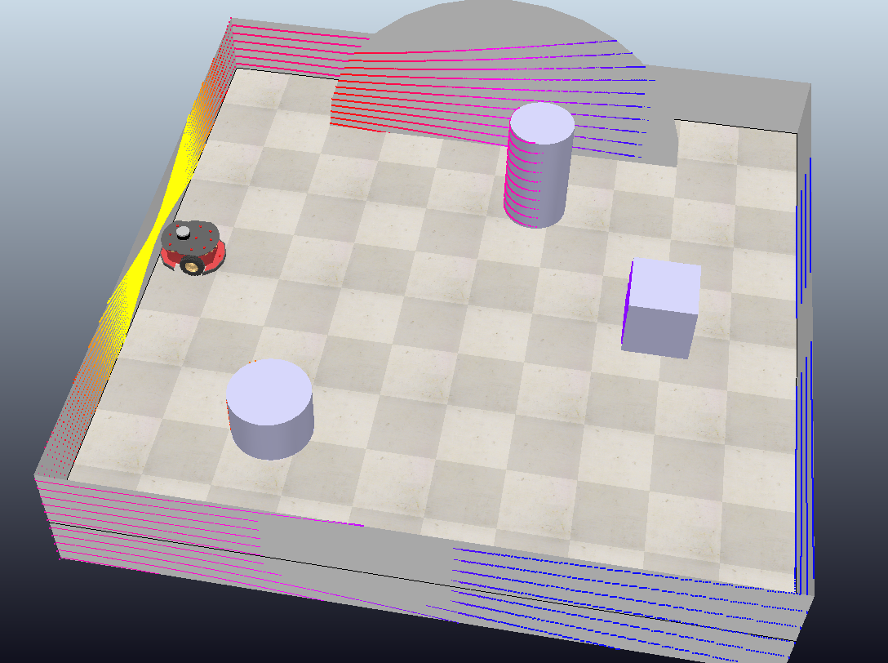
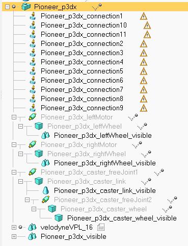
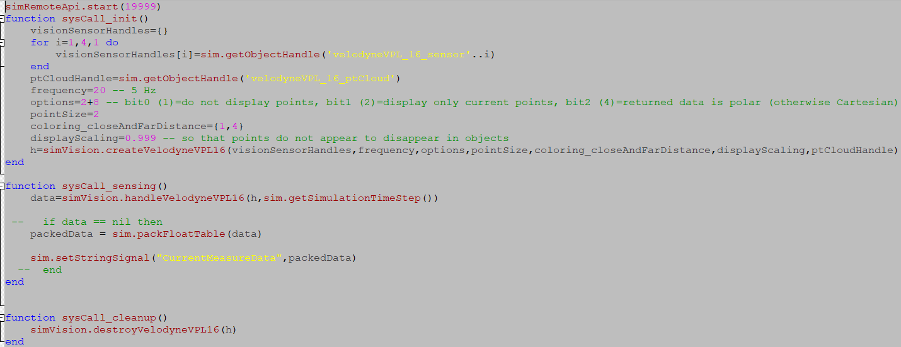

# Ch8_MobileRobotNavigationSystem

## Problem Statement:

This repository contains the code to demonstrate content from chapter 8 Mobile Robot Navigation. In particular we show an example of the vector filed histogram technique described in the vector filed histogram section of the chapter. We employ Coppeliasim to simulate the robotics and collect lidar data. The lidar data is passed to a python program through the remote api provided by Coppeliasim. The lidar data is transformed into polar coordinates such that the objects around the robot can be classified by an angle theta and a radius from the center point of the robot r. The polar histogram is displayed throughout the program and it depicts the obstacle density around the robot. We break the 360 degrees around the robot into 18 20 degree sectors. Each sector has its own density and the decision to turn or continue straight is decided when the obstacle density surpasses a set threshold. The equation constants can be tuned in order to make the density value more sensitive to how far the robot is from an obstacle. The threshold can also be tuned to allow the robot to come closer to obstacles before deciding to take evasive action.

## Dependencies:


Requirements In order to run the code in this repository the user will need to install the following dependencies
- matplotlib library
- numpy library
- coppeliasim
- coppeliasim remote python api

Installation Instructions
- [matplotlib](https://www.tutorialspoint.com/how-to-install-matplotlib-in-python)
- [numpy](https://numpy.org/install/)
- [coppeliasim](https://coppeliarobotics.com/downloads)
- coppeliasim remote python api - included in installation

## Pre-requisites:

- Python programming knowledge
- Access to coppeliasim and simulator knowledge
- Knowledge of coppeliasim [remote python api](https://www.coppeliarobotics.com/helpFiles/en/remoteApiFunctionsPython.htm)
- A development environment - I prefer [vscode](https://code.visualstudio.com/)

## Run Instructions

In order to run the simulation open the coppeliasim LidarMobileRobot.ttt file provided in the repository. Select the play button at the top and the simulation will being. The robot will sit in an idle position until we start the python program. We must start the simulation first otherwise the remote connection that is setup by the code will fail. Once the simulation is running, run the LidarPolarHistogram.py file. This will begin reading data from the lidar sensor on the robot in the simulation and updating the motors based on the surroundings of the robot. 


## Code

The code is structured in the following manner. Please read through the explanations and code at the same time for the best understanding

- Open the LidarPolarHistogram.py file
- Lines 1-40 are used to import the required libraries in dependencies and create a connection with the already running simulation.
- Lines 44-60 are used to grab the handles for the motor objects in the simulation such that we can set the velocity of each motor on the mobile robot. We also setup the initial code that is needed for plotting the output of our histogram visualization to aid the view of the simulation. 
- Lines 60-141 describe the primary loop that will run throughout the simulation. We first use the remote api to upack the lidar data that is sent from the simulation. The lidar data is packed as a 1-d array so we must transform it back into a list of shape (n,3). Each row contains an x, y, and z value relative to the position of the robot. We transform the distance data from cartesian coordinates to polar coordinates which allows us to break down the objects around the robot into sectors. We then use the formula m = (c)(a - b * d) and sum all of the points in the region to compute the obstacle density for a given sector. We utilize a sector count of 18 which allows each sector to cover 20 degrees. The robot will travel in a straight line unless an obstacle density threshold is surpassed in the -60 to 60 degree range in front of the robot. If the threshoold is surpassed the robot will rotate in place until it is clear to travel forward again. 

## Simulation

Our simulation setup is fairly straightforward. We drop multiple simple shapes into the plane with the robot and give them the detectable and collidable properties. This allows them to be detected by the lidar sensor. We use a predefined mobile robot built into copelliasim and add a lidar sensor to it by placing it within the hierarchy of the mobile robot. 

The lidar sensor has a child script attached to it. Child scripts are used to allow extra programming function to be added to basic components in coppeliasim. We utilize the child script on the lidar sensor to make the remote connection to our python program with the command ``` simRemoteApi.start(19999) ```. We then pack the lidar data within the child script and configure the lidar sensor to pack all four quadrants of the data together all within one send. The following shows the child script and the robot environment





